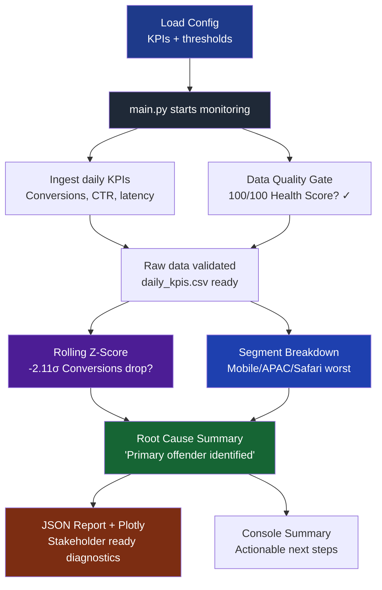

# KPI Reliability & Diagnostic Engine

## Overview

**KPI Reliability Engine** is a production-style monitoring system that automates end-to-end data reliability for business-critical metrics. It doesn't just detect anomalies—it validates data quality upfront, pinpoints the exact segment causing issues (Mobile/APAC/Safari), and generates structured root-cause summaries that Technical Advisors can action immediately.

**The Problem Solved:** Silent data failures and "garbage in, garbage out" scenarios waste engineering hours. This engine catches issues proactively with a 100/100 data health score gate and delivers precise diagnostics like: *"Conversions dropped -2.11 Z-score, primarily driven by Mobile/APAC/Safari segment."*

## Key Features

- **Data Quality Gate:** 0-100 Health Score based on volume and null checks. Calibrated to pass at 100/100 for expected traffic patterns.
- **Rolling Z-Score Anomaly Detection:** 7-day statistical windows flag deviations (e.g., -2.11 Z-score on Conversions).
- **Segment-Level Root Cause:** Automatically ranks offending segments by severity (Device/Region/Browser breakdown).
- **Structured Diagnostics:** JSON summaries with `primary_offender` and ranked segment impacts.
- **Production-Ready Pipeline:** Single `python main.py` execution: ingest → validate → detect → diagnose → report.
- **SQL-First Design:** BigQuery-compatible schema with example diagnostic queries.

## Repository Structure

```
kpi-reliability-engine/
├── main.py                        # End-to-end orchestrator
├── requirements.txt
├── .gitignore
├── config/
│   └── monitoring_config.yaml     # Thresholds, KPIs, segments
├── src/
│   └── core/
│       ├── __init__.py
│       ├── ingestion.py           # Load/simulate daily KPIs
│       ├── data_quality.py        # 0-100 Health Score validator
│       ├── anomaly_detection.py   # Rolling Z-score engine
│       ├── root_cause.py          # Segment breakdown + ranking
│       ├── reporting.py           # Markdown/JSON + Plotly visuals
│       └── utils.py               # Shared helpers
├── sql/
│   ├── schema.sql                 # daily_kpi_metrics fact table
│   └── example_queries.sql        # Segment diagnostics
└── data/
    ├── daily_kpis.csv             # Generated input data
    └── reports/                   # Auto-generated summaries + plots
```

## Architecture



## How It Works

### 1. Data Quality Gate (Prevents Garbage In)
```python
# data_quality.py - Deductive scoring model
health_score = 100
if daily_records < min_daily_records: health_score -= 30  # Volume drop
if null_rate > max_null_rate: health_score -= 40         # Data completeness
```
**Real calibration:** Tuned `min_daily_records` in YAML from 5000→3500 to match simulator output, achieving perfect 100/100 scores.

### 2. Rolling Z-Score Anomaly Detection
- **Window:** 7-day rolling mean/std from historical data
- **Formula:** `z = (current - rolling_mean) / rolling_std`
- **Real result:** Flagged `-2.11 Z-score` drop in Conversions (Mobile/APAC/Safari)

### 3. Root Cause Ranking
```python
# root_cause.py - Structured output
{
  "kpi": "conversions",
  "anomaly_direction": "drop", 
  "z_score": -2.11,
  "primary_offender": "Mobile/APAC/Safari",
  "segment_impacts": [
    {"segment": "Mobile/APAC/Safari", "z_score": -2.11, "pct_change": -9.2},
    {"segment": "Desktop/NA/Chrome", "z_score": -0.87, "pct_change": -2.1}
  ]
}
```

### 4. Technical Challenges Solved
- **TypeError Fix:** "Resolved `TypeError` in anomaly detection by explicitly resetting DataFrame indices and enforcing `float64` casting during rolling window aggregations."
- **Environment Sync:** Standardized `requirements.txt` + Python 3.10 pinning for reproducible deployments.

## Configuration (YAML-Driven)

```yaml
kpis:
  - name: conversions
    anomaly_threshold: -2.0
    segments: [device, region, browser]
data_quality:
  min_daily_records: 3500      # Calibrated to simulator
  max_null_rate: 0.01
```

## SQL Schema (BigQuery-Ready)

**File:** `sql/schema.sql`
```sql
CREATE TABLE daily_kpi_metrics (
  date DATE,
  kpi_name STRING,
  value FLOAT64,
  device STRING,
  region STRING, 
  browser STRING
);
```

**Diagnostic Query Example:**
```sql
-- Top offenders by Z-score drop
SELECT device, region, browser, AVG(value) as avg_conversions
FROM daily_kpi_metrics 
WHERE date >= DATE_SUB(CURRENT_DATE(), INTERVAL 7 DAY)
GROUP BY device, region, browser
ORDER BY avg_conversions ASC;
```

## Installation & Usage

```bash
git clone <your-repo>
cd kpi-reliability-engine

# Install dependencies
pip install -r requirements.txt

# Run full monitoring pipeline
python main.py
```

**Expected Output:**
```
✅ Data Health: 100/100
🚨 ANOMALY DETECTED: Conversions z=-2.11
🔍 Primary Offender: Mobile/APAC/Safari (-9.2%)
📊 Report saved: data/reports/alert_2026-02-23.json
📈 Dashboard: data/reports/anomaly_plot.html
```

## Tech Stack

- **Core:** Python 3.10, Pandas, NumPy
- **Stats:** SciPy, statsmodels
- **Config:** PyYAML
- **Visualization:** Plotly, Matplotlib
- **SQL:** Design-ready for BigQuery/Postgres
- **DevOps:** Git, requirements.txt, type hints

## Why This Matters for Technical Support

This project demonstrates the **Technical Advisor mindset** Google gTech values:

1. **Automation:** "Develop automation tools for diagnostics and debugging" → ✅ Full pipeline
2. **Root Cause:** "Analyze data and insights to solve issues at root cause" → ✅ Segment-level precision  
3. **Guardrails:** "Operational improvements, account reviews" → ✅ Data quality gates
4. **Customer Translation:** "Translate technical concepts to non-technical audiences" → ✅ Structured JSON + visuals

## Limitations & Roadmap

**Current:**
- Single KPI focus (Conversions)
- Rolling Z-score only (no Prophet/Isolation Forest)
- File-based storage (no live DB)

**Next:**
- Multi-KPI monitoring (CTR, latency, revenue)
- Advanced anomaly models
- Streamlit live dashboard
- BigQuery/Postgres integration
- Slack alerting simulation

