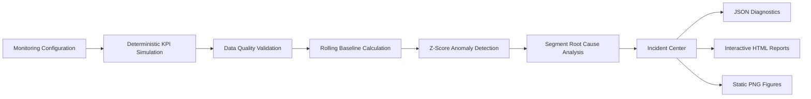

# KPI Monitoring & Diagnostic Engine
ETL, statistical anomaly detection, segment-level diagnostics, and incident reporting for KPI health monitoring

An end-to-end analytics diagnostics engine that validates KPI health, detects abnormal metric movement, isolates the segment driving the anomaly, and surfaces structured incident reports for investigation.

---

## System Architecture



---

## Business Problem

KPI dashboards show when a metric moves, but they do not explain why.

This project builds the analytics workflow required to answer questions like:

- Is the KPI data healthy enough to trust?
- Is the metric moving outside expected behavior?
- Which segment is most likely driving the anomaly?
- What evidence should be packaged for investigation?
- How do we summarize the incident clearly for analysts and stakeholders?

---

## Dataset Profile

The system simulates segmented KPI data across three KPI families and evaluates metric behavior across device, region, and browser dimensions.

- KPI families configured: **3**
- `conversion_rate`
- `ctr`
- `latency_ms`
- Segment combinations evaluated: **18**
- `2 devices × 3 regions × 3 browsers`
- Observations processed: **540**
- Rolling baseline window: **7 observations**
- Total anomalies detected: **51**
- Diagnostic runtime: **0.04 seconds**

---

## Diagnostic Model

The KPI engine is modeled as a statistical monitoring workflow with one primary offender per incident and a ranked anomaly list for supporting evidence.

### Monitored KPI behavior
- Default monitored KPI: `conversion_rate`
- Latest anomaly date: `2026-06-08`
- Actual value: `0.0606`
- Rolling baseline: `0.0988`
- Z-score: `-9.89`
- Primary offender: `Mobile / EMEA / Safari`

### Incident Center scenarios
- `conversion_rate` → `Mobile / EMEA / Safari` → `z = -9.89` → `Critical`
- `ctr` → `Desktop / NA / Chrome` → `z = -8.55` → `Critical`
- `latency_ms` → `Mobile / APAC / Firefox` → `z = 11.84` → `Critical`

---

## Processing Pipeline

The engine follows a deterministic sequence from monitoring setup to incident output.

### Validate
- Load monitoring configuration from YAML.
- Validate KPI data quality before analysis.
- Score completeness and health of the dataset.

### Detect
- Compute rolling baselines using prior 7 observations per segment.
- Apply `shift(1).rolling(window=7, min_periods=7)` to avoid leakage.
- Detect anomalies using Z-score deviation from the baseline.

### Diagnose
- Rank segment-level anomalies.
- Identify the primary offender.
- Generate a structured incident summary for review.

### Report
- Export JSON diagnostics.
- Render interactive HTML reports.
- Generate static PNG figures for review and presentation.

---

## Data Quality Check

The verified latest run passed all validation checks.

- Data Quality Status: **PASS**
- Data Quality Score: **100/100**

The engine validates KPI health before anomaly evaluation so downstream diagnostics are based on trustworthy input.

---

## Report Outputs

The report artifacts provide the evidence behind the diagnosis.

### Incident Center


### Incident Summary


### Anomaly Z-Score


### Segment Root Cause


### KPI Timeseries


---

## Statistical Logic

The engine uses a rolling baseline per segment built from prior observations only.

- Baseline window: **7**
- Implementation: `shift(1).rolling(window=7, min_periods=7)`
- Detection method: rolling Z-score deviation from baseline
- Root cause output: one `primary_offender` plus a `ranked_anomalies` list

The root cause visualization is generated from `ranked_anomalies`, while the incident summary surfaces the primary offender and the supporting context.

---

## Core Features

- Data quality validation with scored output.
- Deterministic KPI simulation.
- Three KPI families configured.
- Segment-level anomaly detection.
- Rolling baseline Z-score analysis.
- Primary offender identification.
- Ranked anomaly diagnostics.
- Incident Center dashboard output.
- JSON diagnostic export.
- Interactive HTML report generation.
- Static PNG report export.

---

## Tech Stack

- Python
- pandas
- NumPy
- PyYAML
- Plotly
- Kaleido
- JSON
- SQL schema and example diagnostic queries

---

## Generated Outputs

### JSON
- `data/reports/latest_diagnostic.json`

### HTML
- `data/reports/kpi_timeseries.html`
- `data/reports/anomaly_zscore.html`
- `data/reports/segment_root_cause.html`
- `data/reports/incident_center.html`

### PNG
- `reports/figures/kpi_timeseries.png`
- `reports/figures/anomaly_zscore.png`
- `reports/figures/segment_root_cause.png`
- `reports/figures/incident_summary.png`
- `reports/figures/incident_center.png`

---

## How to Run

```bash
python -m venv .venv
source .venv/bin/activate
pip install -r requirements.txt
python main.py
```

After execution, review the JSON diagnostics in `data/reports/`, the interactive HTML outputs in `data/reports/`, and the static figures in `reports/figures/`.

---

## Project Structure

```text
kpi_monitoring_diagnostic_engine/
├── config/
│   └── monitoring_config.yaml
├── data/
│   └── reports/
├── reports/
│   └── figures/
├── sql/
│   ├── schema.sql
│   └── example_queries.sql
├── src/
│   └── core/
│       ├── ingestion.py
│       ├── data_quality.py
│       ├── anomaly_detection.py
│       ├── root_cause.py
│       └── reporting.py
├── main.py
├── requirements.txt
└── README.md
```

---

## Project Value

This project turns KPI movement into a structured diagnostic workflow with validated inputs, statistical anomaly detection, segment-level root cause analysis, and analyst-ready incident reporting.

It is especially strong for:
- Data Analyst
- Product Analyst
- BI Analyst
- Analytics Engineer
- Business Analyst