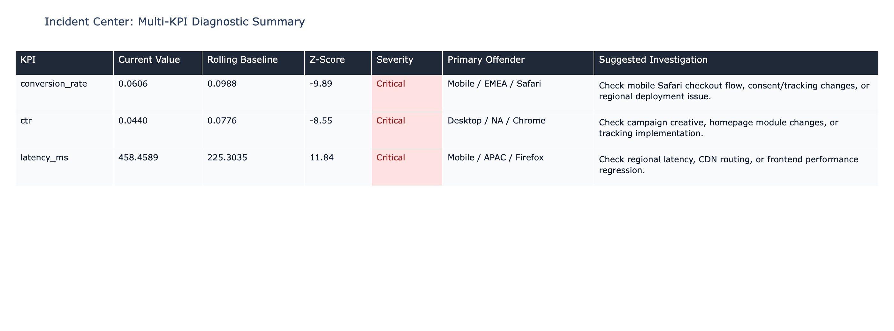
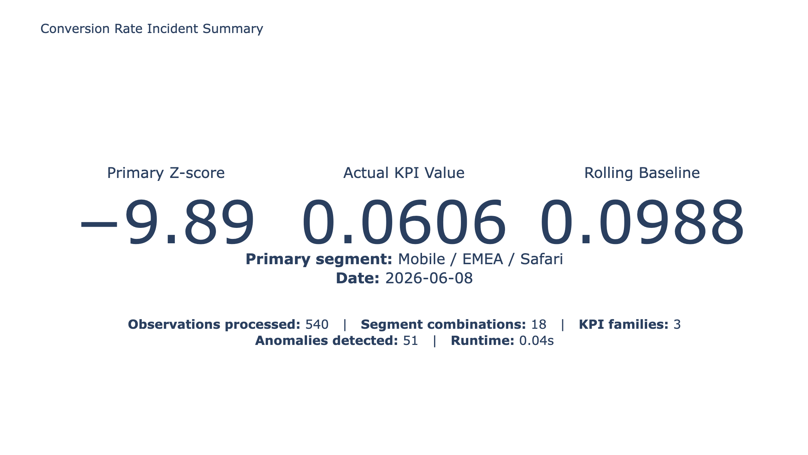
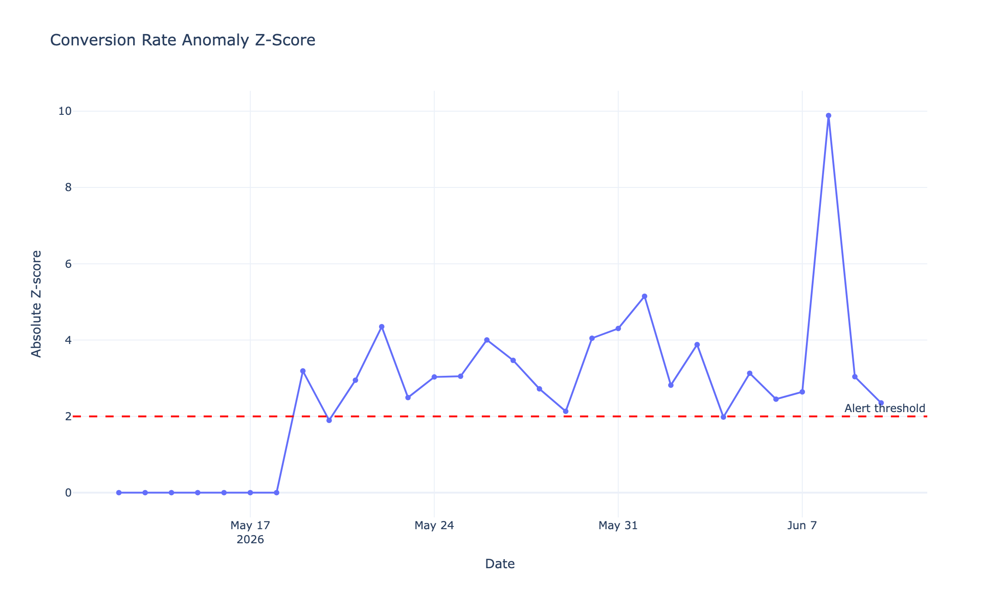
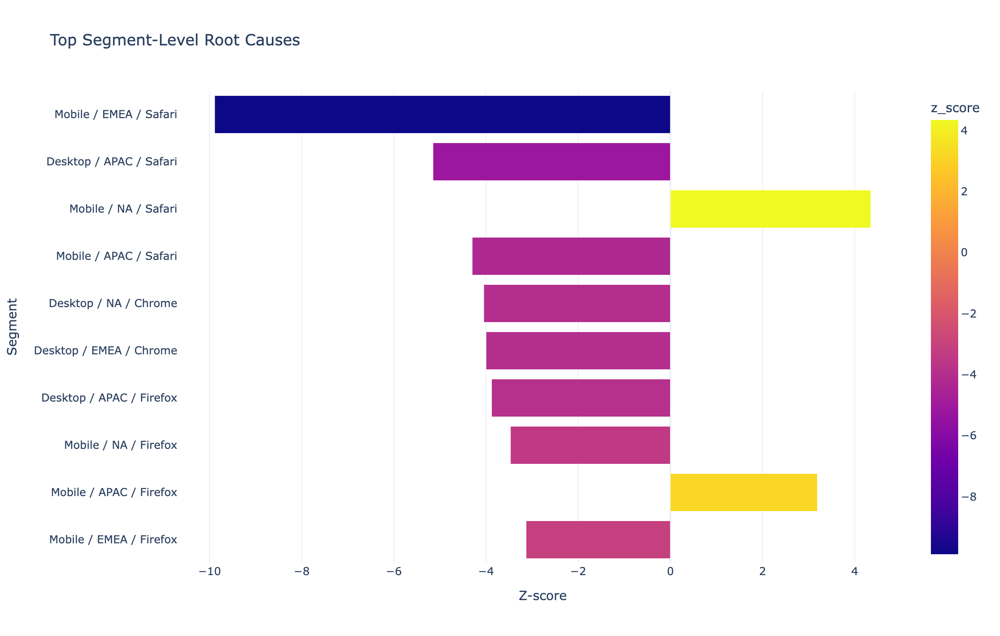
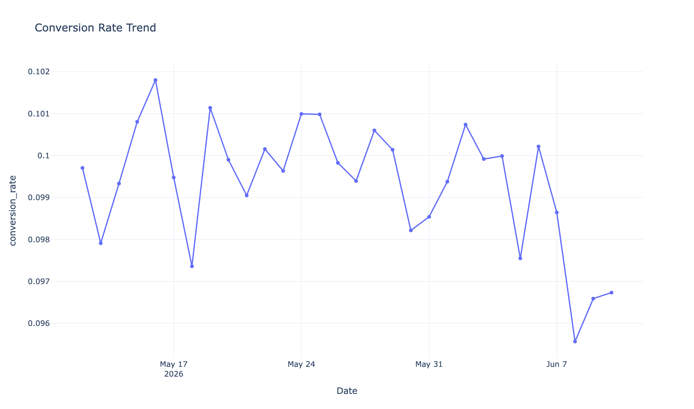
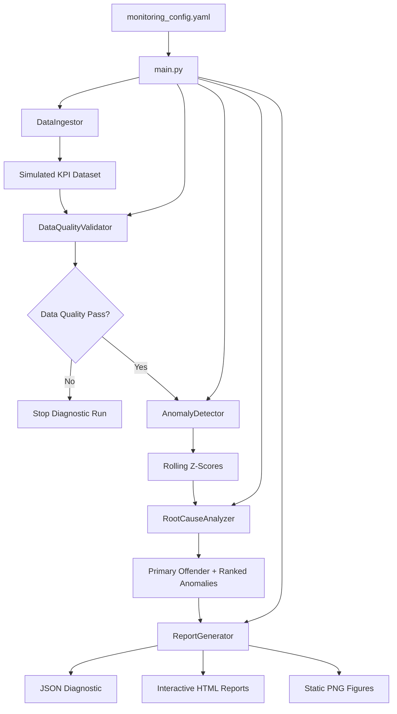
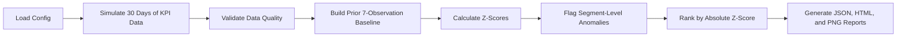
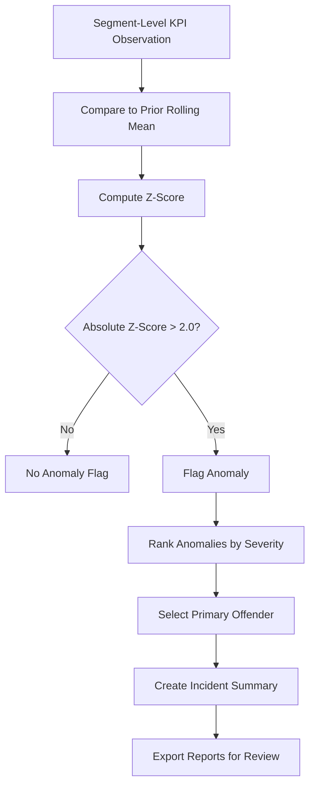

# KPI Monitoring & Diagnostic Engine

## Overview

KPI Monitoring & Diagnostic Engine is a lightweight Python analytics workflow for validating KPI data, detecting metric anomalies, and isolating the business segment driving the issue.

The engine runs locally from `main.py`. It simulates segmented KPI data, validates data quality, monitors the configured KPI, computes rolling Z-scores, identifies the primary offender, and exports diagnostic reports as JSON, interactive Plotly HTML, and static PNG figures.

The repository remains intentionally lightweight. It uses a production-style diagnostic workflow without Dash, databases, cloud services, schedulers, or alerting systems.

## Business Problem

Business dashboards often show that a KPI moved, but they do not always explain whether the data is reliable, whether the movement is statistically unusual, or which segment caused the change.

The engine validates the input data before analysis, detects abnormal KPI movement against a rolling baseline, and isolates the segment combination most responsible for the incident. That workflow helps analytics teams move from metric observation to diagnostic explanation.

This pattern applies to e-commerce, SaaS, product analytics, marketing analytics, fintech, marketplace operations, media platforms, and BI operations teams that need faster KPI triage.

## Key Results

Latest run from `data/reports/latest_diagnostic.json`:

| Metric | Value |
|---|---:|
| Data quality score | 100/100 |
| Data quality status | PASS |
| Monitored KPI | conversion_rate |
| Anomaly date | 2026-06-08 |
| Primary offender | Mobile / EMEA / Safari |
| Actual value | 0.0606 |
| Rolling baseline | 0.0988 |
| Z-score | -9.89 |
| KPI families configured | 3 |
| Segment combinations evaluated | 18 |
| Observations processed | 540 |
| Anomalies detected | 51 |
| Rolling baseline window | 7 prior observations |
| Diagnostic runtime | 0.04 seconds |

## Example Incident

The platform detected a `conversion_rate` anomaly on `2026-06-08`.

```text
Primary offender: Mobile / EMEA / Safari
Actual value: 0.0606
Rolling baseline: 0.0988
Z-score: -9.89
```

The workflow isolates a sharp conversion-rate drop in the `Mobile / EMEA / Safari` segment. For an analytics or product team, this points investigation toward a localized funnel, browser, release, tracking, or user-experience issue rather than a broad business-wide decline.

## Dashboard Outputs

Static PNG figures are generated under `reports/figures/` for GitHub rendering. Interactive Plotly HTML reports are generated under `data/reports/` for local review.

### Incident Center

The Incident Center consolidates deterministic KPI scenarios into one recruiter-readable diagnostic view. It shows the monitored KPI, current value, rolling baseline, Z-score, severity, primary offender, and suggested investigation path.



### Incident Summary



### Anomaly Z-Score



### Segment Root Cause



### KPI Time Series



## Architecture



## Processing Pipeline



## Diagnostic Flow



## Core Features

- The engine validates data quality with volume and null-completeness checks.
- The platform monitors the configured KPI: `conversion_rate`.
- The configuration includes 3 KPI families: `conversion_rate`, `ctr`, and `latency_ms`.
- The workflow evaluates 18 segment combinations across `device_type`, `region`, and `browser`.
- The anomaly detector compares each observation against the prior 7 observations for the same segment.
- The diagnostic layer selects one primary offender and exports a ranked anomaly list.
- The reporting layer exports JSON, interactive HTML, and static PNG figures.
- The Incident Center consolidates deterministic `conversion_rate`, `ctr`, and `latency_ms` scenarios into one multi-KPI report.
- The simulation uses a deterministic seed for reproducible portfolio outputs.

## Tech Stack

- Python
- pandas
- NumPy
- PyYAML
- Plotly
- Kaleido
- SQL examples

## Generated Outputs

Running `python main.py` generates the current diagnostic artifacts.

JSON:

```text
data/reports/latest_diagnostic.json
```

HTML:

```text
data/reports/kpi_timeseries.html
data/reports/anomaly_zscore.html
data/reports/segment_root_cause.html
data/reports/incident_center.html
```

PNG:

```text
reports/figures/incident_summary.png
reports/figures/incident_center.png
reports/figures/anomaly_zscore.png
reports/figures/segment_root_cause.png
reports/figures/kpi_timeseries.png
```

The repository also contains an older `data/reports/latest_diagnostic.txt` artifact. The current pipeline writes JSON, HTML, and PNG outputs.

## Quickstart

```bash
python -m venv .venv
source .venv/bin/activate
pip install -r requirements.txt
python main.py
```

After the run completes, open the HTML files locally for interactive charts or view the PNG files directly in GitHub.

## Project Structure

```text
.
├── main.py
├── config/
│   └── monitoring_config.yaml
├── src/
│   └── core/
│       ├── ingestion.py
│       ├── data_quality.py
│       ├── anomaly_detection.py
│       ├── root_cause.py
│       ├── reporting.py
│       └── utils.py
├── sql/
│   ├── schema.sql
│   └── example_queries.sql
├── data/
│   └── reports/
├── reports/
│   └── figures/
├── requirements.txt
└── README.md
```
