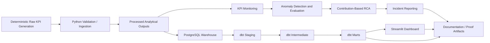

# KPI Reliability & Diagnostic Engine


## Executive Summary

KPI Reliability & Diagnostic Engine is an automated KPI monitoring and diagnostic platform that turns KPI movement into diagnosis and action. Instead of stopping at “the metric dropped,” the system identifies which KPI moved, whether the movement is anomalous, which dimensions contributed most, and what the business should do next.

The project is built as a portfolio-ready analytics case study for Analytics Engineer, BI Analyst, Data Analyst, and Product Analyst roles. It combines deterministic KPI generation, data quality validation, monitoring, anomaly detection, contribution-based root cause analysis, incident reporting, a PostgreSQL/dbt warehouse, and a Streamlit dashboard.

The core value is clarity. Dashboards often show movement, but not explanation. This repository shows how to move from raw KPI signals to reproducible evidence, ranked dimensional contributions, and executive-ready incident summaries.

## Business Problem

KPI teams spend time checking whether data is trustworthy, investigating anomalies, and manually assembling root-cause evidence. That slows decision-making and makes it difficult to explain what actually happened.

This project addresses:
- KPI monitoring with expected vs actual comparison.
- False positives from simplistic thresholds.
- Manual RCA across many dimensions.
- Executive incident communication.
- Reproducible evidence for interview and resume review.

## What This Project Does

- Data quality scoring.
- KPI monitoring.
- Anomaly detection.
- Model evaluation.
- Contribution-based RCA.
- Incident reporting.
- PostgreSQL warehouse.
- dbt staging/intermediate/mart models and tests.
- Streamlit dashboard.

## Architecture


```mermaid
flowchart LR
    A[Deterministic Raw KPI Generation] --> B[Python Validation / Ingestion]
    B --> C[Processed Analytical Outputs]
    C --> D[KPI Monitoring]
    D --> E[Anomaly Detection and Evaluation]
    E --> F[Contribution-Based RCA]
    F --> G[Incident Reporting]
    C --> H[PostgreSQL Warehouse]
    H --> I[dbt Staging]
    I --> J[dbt Intermediate]
    J --> K[dbt Marts]
    K --> L[Streamlit Dashboard]
    G --> M[Documentation / Proof Artifacts]
    L --> M
    K --> M
```

## Tech Stack

### Data Engineering
- Python.
- pandas.
- NumPy.
- Docker.
- PostgreSQL.

### Analytics Engineering
- dbt-postgres.
- SQL.
- PostgreSQL warehouse schemas.
- dbt staging, intermediate, and mart layers.

### Machine Learning / Statistics
- Rolling Z-score anomaly detection.
- Residual-based anomaly detection.
- Deterministic NumPy ridge regression fallback.
- Evaluation with precision, recall, and F1.

### BI / Reporting
- Streamlit.
- JSON incident outputs.
- Markdown incident reports.
- HTML incident reports.
- PNG report figures.

### Testing / Validation
- pytest.
- Schema contract validation.
- Data quality checks.
- Warehouse verification.
- dbt debug, dbt run, and dbt test.

## Repository Structure

```text
config/
data/raw/
data/processed/
data/reports/
dashboards/
dbt/
docs/
scripts/
sql/
src/core/
tests/
```

## Data and KPIs

The raw KPI generator produces a deterministic synthetic dataset with:
- 121,500 rows.
- 150 days of history.
- Dimensions:
  - region.
  - device_type.
  - browser.
  - channel.
  - business_segment.
- KPIs:
  - conversion_rate.
  - click_through_rate.
  - average_order_value.
  - latency_ms.
  - revenue_per_session.

The repository also includes labeled synthetic incidents for evaluation and RCA proof. Those labels are used only as proof material, not as model features.

Key outputs from the data foundation:
- `data/raw/kpi_daily_metrics.csv`.
- `config/schema_contract.yaml`.
- `data/processed/kpi_validated.csv`.
- `data/reports/data_quality_report.json`.

## Pipeline Overview

1. Data generation.
2. Data quality validation.
3. KPI monitoring.
4. Anomaly detection.
5. Root cause analysis.
6. Incident reporting.
7. PostgreSQL warehouse.
8. dbt transformations.
9. Streamlit dashboard.

The pipeline is deterministic, local-first, and designed to leave a clear audit trail from input generation through final reporting.

## Data Quality Layer

The data quality layer validates the input dataset before monitoring or anomaly detection begins. It checks schema validity, accepted values, nulls, duplicates, freshness, completeness, volume, and numeric ranges.

The quality score is explainable and combines those checks into a single health signal. The verified latest run passed all validation checks and achieved a data quality score of 100/100.

Primary outputs:
- `data/reports/data_quality_report.json`.
- `data/processed/kpi_validated.csv`.

## KPI Monitoring Layer

The monitoring layer computes rolling averages, a moving baseline, expected vs actual values, variance, threshold configuration, and monitoring status.

This layer is designed to answer whether a KPI moved beyond expected behavior and whether it should be investigated further. It provides the first-pass diagnostic signal before deeper anomaly detection and RCA.

Primary outputs:
- `data/processed/kpi_monitoring_table.csv`.
- `data/reports/kpi_monitoring_summary.json`.

## Anomaly Detection and Model Evaluation

The anomaly layer compares three methods:
- Monitoring-threshold baseline.
- Rolling Z-score detector.
- ML residual detector.

Local runs use a deterministic NumPy ridge regression residual fallback because XGBoost and scikit-learn imports were unavailable in the local environment through SciPy/native dependency issues. That fallback is the honest, runnable implementation in this repository.

Evaluation uses synthetic incident labels only as proof material, not as model features. The best detector by F1 is `ml_residual`.

Primary outputs:
- `data/processed/anomaly_results.csv`.
- `data/reports/model_evaluation.csv`.
- `data/reports/model_comparison.json`.

## Root Cause Analysis

RCA uses `residual_anomaly` by default because it had the best F1 score. The method is contribution-based and identifies which dimension combinations contributed most to KPI degradation.

It supports:
- lower_is_bad KPIs:
  - conversion_rate.
  - click_through_rate.
  - average_order_value.
  - revenue_per_session.
- higher_is_bad KPIs:
  - latency_ms.

Dimensions analyzed:
- region.
- device_type.
- browser.
- channel.
- business_segment.
- region + device + browser.
- full segment.

Example statements:
- APAC + Mobile + Safari conversion degradation.
- North America + Desktop + Chrome latency issue.
- revenue_per_session degradation with channel and business-segment context.

Primary outputs:
- `data/processed/rca_contribution_table.csv`.
- `data/reports/root_cause_summary.json`.
- `data/reports/top_root_causes.csv`.

## Incident Reporting

Incident reporting groups anomalies by KPI and date and produces executive-ready incident records with:
- severity.
- confidence score.
- suspected dimensions.
- recommended actions.
- executive summary.
- supporting metrics.

Confidence is a practical triage score, not a statistical probability.

Primary outputs:
- `data/reports/latest_incident.json`.
- `data/reports/latest_incident.md`.
- `data/reports/latest_incident.html`.
- `data/reports/incident_history.csv`.

## PostgreSQL Warehouse

Phase 6A adds a local PostgreSQL warehouse with `raw`, `analytics`, and `marts` schemas.

Loaded objects include:
- raw source tables for KPI, monitoring, anomaly, RCA, and incident outputs.
- star-schema dimensions for date, KPI, region, device, browser, channel, and business segment.
- fact tables for daily KPI, monitoring, anomalies, RCA, and incidents.
- marts for KPI health, incident summary, and data quality summary.

Verified row counts:
- `raw.raw_kpi_daily_metrics`: 121,500.
- `raw.raw_kpi_monitoring`: 121,500.
- `raw.raw_anomaly_results`: 121,500.
- `raw.raw_rca_contributions`: 2,900.
- `raw.raw_incident_history`: 12.
- `analytics.fact_kpi_daily`: 121,500.
- `analytics.fact_kpi_monitoring`: 121,500.
- `analytics.fact_kpi_anomalies`: 121,500.
- `analytics.fact_rca_contributions`: 2,900.
- `analytics.fact_incidents`: 12.
- `marts.mart_kpi_health`: 750.
- `marts.mart_incident_summary`: 12.
- `marts.mart_data_quality_summary`: 1.

Warehouse commands:
```bash
docker compose up -d
python scripts/load_postgres.py
python scripts/verify_warehouse.py
docker compose down
```

On some local Docker Desktop setups, credential helper or context configuration may require adjustment.

## dbt Analytics Engineering Layer

Phase 6B adds a dbt project named `kpi_reliability_dbt` on top of the verified warehouse.

Project structure:
- Sources from the `raw` schema.
- Staging models in `dbt_staging`.
- Intermediate models in `dbt_intermediate`.
- Marts in `dbt_marts`.

Model layers:
- Staging: typed source projections.
- Intermediate: monitoring rollups, anomaly event shaping, RCA ranking, incident enrichment.
- Marts: dimensions, facts, and business-facing summaries.

dbt tests cover:
- unique.
- not_null.
- relationships.
- accepted_values.
- custom contribution-share and confidence bounds.

Live verification results:
- 24 models.
- 148 data tests.
- dbt debug passed.
- dbt run passed.
- dbt test passed.

Local profile handling:
- `dbt/profiles.example.yml` contains local defaults.
- `dbt/profiles.yml` is local-only and ignored by git.

dbt commands:
```bash
cp dbt/profiles.example.yml dbt/profiles.yml
DBT_PROFILES_DIR=dbt dbt debug --project-dir dbt
DBT_PROFILES_DIR=dbt dbt run --project-dir dbt
DBT_PROFILES_DIR=dbt dbt test --project-dir dbt
```

## Streamlit Dashboard

The Streamlit dashboard reads the local CSV and JSON outputs by default and does not require PostgreSQL for normal usage.

Dashboard entry point:
- `dashboards/streamlit_app.py`

Pages:
- Executive Overview.
- KPI Health.
- Anomaly Timeline.
- Root Cause Explorer.
- Data Quality.
- Incident Center.

Run command:
```bash
streamlit run dashboards/streamlit_app.py
```

Screenshot checklist:
- `dashboards/screenshots/README.md`

Screenshots remain manual unless you capture them locally.

## Key Outputs

| Output file | Purpose | Resume proof value |
| --- | --- | --- |
| `data/raw/kpi_daily_metrics.csv` | Deterministic synthetic KPI input data. | Shows raw data generation and reproducible inputs. |
| `data/processed/kpi_validated.csv` | Validated KPI dataset after schema and quality checks. | Shows data quality validation. |
| `data/processed/kpi_monitoring_table.csv` | Monitoring table with baselines, variance, and status. | Shows KPI monitoring logic. |
| `data/processed/anomaly_results.csv` | Anomaly detection outputs across methods. | Shows anomaly detection implementation. |
| `data/processed/rca_contribution_table.csv` | Contribution-based RCA evidence table. | Shows root-cause diagnostics. |
| `data/reports/data_quality_report.json` | Data quality score and validation summary. | Shows trust and validation proof. |
| `data/reports/kpi_monitoring_summary.json` | KPI monitoring summary. | Shows monitoring output documentation. |
| `data/reports/model_evaluation.csv` | Precision/recall/F1 evaluation results. | Shows model comparison and evaluation rigor. |
| `data/reports/model_comparison.json` | Best-detector comparison output. | Shows detector selection evidence. |
| `data/reports/root_cause_summary.json` | RCA summary by KPI and dimension. | Shows diagnostic explanation. |
| `data/reports/latest_incident.json` | Structured incident payload. | Shows incident packaging for stakeholders. |
| `data/reports/latest_incident.md` | Markdown incident report. | Shows executive-ready documentation. |
| `data/reports/latest_incident.html` | HTML incident report. | Shows shareable report output. |
| `data/reports/incident_history.csv` | Incident history log. | Shows incident tracking over time. |
| `sql/diagnostic_queries.sql` | Ready-to-run portfolio diagnostic queries. | Shows SQL analysis and proof queries. |
| `dashboards/streamlit_app.py` | Streamlit dashboard entry point. | Shows interactive reporting layer. |
| `dbt/dbt_project.yml` | dbt project definition. | Shows analytics engineering implementation. |

## Sample SQL

`sql/diagnostic_queries.sql` contains ready-to-run portfolio queries for:
- KPI health.
- anomaly counts.
- RCA contributors.
- incident summaries.
- executive health rollups.
- example dimension drill-downs.

## How to Run

### Basic pipeline
```bash
python scripts/run_pipeline.py --regenerate
python -m pytest tests
```

### Dashboard
```bash
streamlit run dashboards/streamlit_app.py
```

### Warehouse
```bash
docker compose up -d
python scripts/load_postgres.py
python scripts/verify_warehouse.py
docker compose down
```

### dbt
```bash
cp dbt/profiles.example.yml dbt/profiles.yml
DBT_PROFILES_DIR=dbt dbt debug --project-dir dbt
DBT_PROFILES_DIR=dbt dbt run --project-dir dbt
DBT_PROFILES_DIR=dbt dbt test --project-dir dbt
```

### Full local setup
```bash
python -m pip install -r requirements.txt
python scripts/run_pipeline.py --regenerate
python -m pytest tests
docker compose up -d
python scripts/load_postgres.py
python scripts/verify_warehouse.py
DBT_PROFILES_DIR=dbt dbt debug --project-dir dbt
DBT_PROFILES_DIR=dbt dbt run --project-dir dbt
DBT_PROFILES_DIR=dbt dbt test --project-dir dbt
streamlit run dashboards/streamlit_app.py
docker compose down
```

## Validation Results

- Python tests: 60 passed.
- dbt: 24 models, 148 tests, 0 errors, 0 warnings.
- Warehouse verification: passed.
- Dashboard code: compiled successfully with `py_compile`.
- Streamlit launch: requires a local environment that permits binding a port.

## Resume Claim Proof Matrix

| Resume claim | Evidence in this repo |
| --- | --- |
| Automated KPI monitoring and diagnostic platform. | `scripts/run_pipeline.py`, `src/core/kpi_monitoring.py`, `src/core/anomaly_detection.py`, `src/core/root_cause.py`, `src/core/incident_reporting.py`, `data/processed/kpi_monitoring_table.csv`, `data/reports/latest_incident.json`. |
| Data quality scoring, anomaly detection, and RCA. | `src/core/data_quality.py`, `src/core/anomaly_detection.py`, `src/core/root_cause.py`, `data/reports/data_quality_report.json`, `data/reports/root_cause_summary.json`. |
| Statistical + ML residual anomaly evaluation. | `src/core/anomaly_detection.py`, `src/core/model_evaluation.py`, `data/reports/model_evaluation.csv`, `data/reports/model_comparison.json`, `data/processed/anomaly_results.csv`. |
| PostgreSQL/dbt analytics engineering layer. | `scripts/load_postgres.py`, `scripts/verify_warehouse.py`, `sql/schema.sql`, `dbt/` project, 148 dbt tests. |
| Executive dashboard and incident reporting. | `dashboards/streamlit_app.py`, `src/core/incident_reporting.py`, `data/reports/latest_incident.md`, `data/reports/latest_incident.html`, `data/reports/incident_history.csv`. |

## Interview Talking Points

- Why anomaly detection? To separate normal KPI variation from meaningful movement.
- Why rolling Z-score? It is a simple statistical baseline that is easy to explain.
- Why ML residual detector? It captures structure the statistical baseline misses.
- Why not thresholds only? Static thresholds ignore seasonality and context.
- How does RCA work? It measures contribution to degradation across dimensions.
- Why dbt? It creates tested, documented marts for warehouse consumers.
- How does this help executives? It converts noisy metric movement into an action list.

## Limitations

- Synthetic data, not production data.
- Synthetic incident labels are evaluation proof, not real-world ground truth.
- Local residual detector used a deterministic NumPy fallback, not XGBoost.
- Dashboard screenshots are manual unless you capture them locally.
- Streamlit launch requires a local environment that permits binding a port.
- The project is not production deployed.

## Future Work

- Add real production KPI sources.
- Schedule the pipeline.
- Deploy the dashboard.
- Add alerting via Slack or email.
- Improve the residual model when the environment supports XGBoost or scikit-learn reliably.
- Add CI/CD and hosted dbt docs.
