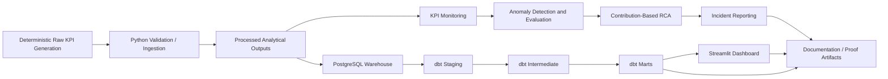

# KPI Reliability & Diagnostic Engine


## Executive Summary

KPI Reliability & Diagnostic Engine is an automated KPI monitoring and diagnostic platform that turns KPI movement into diagnosis and action. Instead of stopping at “the metric dropped,” the system identifies which KPI moved, whether the movement is anomalous, which dimensions contributed most, and what the business should do next.

The project is built as a portfolio-ready analytics case study for Analytics Engineer, BI Analyst, Data Analyst, and Product Analyst roles. It combines deterministic KPI generation, data quality validation, monitoring, anomaly detection, contribution-based root cause analysis, incident reporting, a PostgreSQL/dbt warehouse, and a Streamlit dashboard.

The core value is clarity. Dashboards often show movement, but not explanation. This repository shows how to move from raw KPI signals to reproducible evidence, ranked dimensional contributions, and executive-ready incident summaries.

## Headline Result — Before and After

The original monitoring approach used static thresholds against a moving baseline. It caught every incident, but drowned them in false alarms. Replacing it with **residual-based detection** — comparing actual against a model's expected value rather than against a fixed band — cut false positives by **81%** while holding recall at **100%**.

Measured on 121,500 observations with 342 labelled incident rows:

| Metric | Static threshold (before) | Residual detection (after) | Change |
| :--- | ---: | ---: | :--- |
| True positives | 342 | 342 | unchanged |
| **False positives** | **2,958** | **563** | **−80.97%** |
| False negatives | 0 | 0 | unchanged |
| Precision | 10.36% | 37.79% | **3.65x** |
| Recall | 100.00% | 100.00% | held |
| **F1 score** | **0.1878** | **0.5485** | **+192%** |
| Alerts raised | 3,300 | 905 | −2,395 |

**Why recall mattering more than precision drove the design.** Both detectors find every incident, so the difference is entirely in what they *don't* flag. An on-call analyst working the "before" queue sifts 3,300 alerts to find 342 real ones — roughly 9 false alarms per real incident. The "after" queue is 905 alerts for the same 342 incidents, under 2 false alarms each. Nothing was traded away to get it: false negatives stayed at zero.

A rolling Z-score detector was also evaluated and **rejected**: it cut alert volume to 920 but missed 247 of 342 incidents (recall 27.78%, F1 0.1506). Lower alert volume achieved by going blind is not an improvement, and reporting only its alert-count reduction would have been a misleading result.

Every figure above is reproducible from a clean checkout:

```bash
python3 scripts/run_pipeline.py --regenerate
cat data/reports/model_evaluation.csv
```

Verified 2026-07-25: a full regeneration reproduced all prior outputs **byte-identically** (raw data, validated data, monitoring table, anomaly results, RCA contributions, and model evaluation).

## Two Tracks: Evaluation and Operations

This repository runs the same detector against two different datasets, because they answer
two different questions.

| | **Evaluation track** | **Operations track** |
| :--- | :--- | :--- |
| Data | Synthetic, deterministic, labelled | Wikimedia Pageviews API — real, public, live |
| Question | Is the detector any good? | Does it run unattended on data nobody controls? |
| Metrics | Precision, recall, **F1** | Coverage, anomaly counts, incidents |
| Cadence | On demand | Daily, via GitHub Actions |
| Entry point | `scripts/run_pipeline.py` | `scripts/run_live_pipeline.py` |
| Config | `config/monitoring_config.yaml` | `config/live_monitoring_config.yaml` |

**Why not just use real data?** Because real data has no ground truth. Without labels there
is no precision, no recall, no F1 — the entire before/after result above would cease to
exist. The synthetic track is what makes the accuracy claim measurable; the live track is
what makes it operational. Detector F1 is carried into live incident confidence tagged
`"f1_source": "synthetic_evaluation_track"`, so a number measured on labelled data can never
be mistaken for one measured on live traffic.

### Latest live run

Real output from the Wikimedia Pageviews API — 6 Wikipedia projects × 3 access methods ×
3 agent types:

| Metric | Value |
| :--- | ---: |
| Series monitored | 54 |
| Date range | 2026-04-28 → 2026-07-26 |
| Rows fetched | 4,478 |
| Rows scored | 4,112 |
| Rows held back for baseline warm-up | 366 |
| Fetch coverage | 92.14% |
| Anomalies in 30-day window (Z-score) | 37 (2.5%) |
| Anomalies in 30-day window (residual) | 341 (22.9%) |

**90 days fetched, 30 days reported.** The 28-day rolling baseline uses `.shift(1)`, so a
series needs 29 days of history before its first scoreable day. Fetching only the reporting
window would leave almost every point un-warmed and silently unscored.

**Two honest findings from that run, both unresolved:**
- Fetch coverage is **92.14%**, not 100%. Real API responses have gaps. The run reports
  partial coverage rather than treating missing days as zero.
- The residual detector fires on **22.9%** of the window against **2.5%** for Z-score. Live
  thresholds are inherited from the synthetic track and have not been calibrated for real
  traffic volatility. See `docs/decisions.md` §9 for why they were not simply tuned down.

**Cadence is daily; the window is 30 days.** These are separate concerns — a monitoring
system that only ran monthly would detect an incident up to 30 days late.

## Business Problem

KPI teams spend time checking whether data is trustworthy, investigating anomalies, and manually assembling root-cause evidence. That slows decision-making and makes it difficult to explain what actually happened.

This project addresses:
- KPI monitoring with expected vs actual comparison.
- False positives from simplistic thresholds.
- Manual RCA across many dimensions.
- Executive incident communication.

## What This Project Does

- Data quality scoring.
- KPI monitoring.
- Anomaly detection.
- Model evaluation.
- Contribution-based RCA.
- Incident reporting.
- PostgreSQL warehouse.
- dbt staging/intermediate/mart models and tests.
- Streamlit dashboard.

## Architecture


```mermaid
flowchart LR
    A[Deterministic Raw KPI Generation] --> B[Python Validation / Ingestion]
    B --> C[Processed Analytical Outputs]
    C --> D[KPI Monitoring]
    D --> E[Anomaly Detection and Evaluation]
    E --> F[Contribution-Based RCA]
    F --> G[Incident Reporting]
    C --> H[PostgreSQL Warehouse]
    H --> I[dbt Staging]
    I --> J[dbt Intermediate]
    J --> K[dbt Marts]
    K --> L[Streamlit Dashboard]
    G --> M[Documentation / Proof Artifacts]
    L --> M
    K --> M
```

## Tech Stack

### Data Engineering
- Python.
- pandas.
- NumPy.
- Docker.
- PostgreSQL.

### Analytics Engineering
- dbt-postgres.
- SQL.
- PostgreSQL warehouse schemas.
- dbt staging, intermediate, and mart layers.

### Machine Learning / Statistics
- Rolling Z-score anomaly detection.
- Residual-based anomaly detection.
- Deterministic NumPy ridge regression fallback.
- Evaluation with precision, recall, and F1.

### BI / Reporting
- Streamlit.
- JSON incident outputs.
- Markdown incident reports.
- HTML incident reports.
- PNG report figures.

### Testing / Validation
- pytest.
- Schema contract validation.
- Data quality checks.
- Warehouse verification.
- dbt debug, dbt run, and dbt test.

## Repository Structure

```text
config/
data/
  raw/
  processed/
  reports/
dashboards/
dbt/
docs/
scripts/
sql/
src/
  core/
tests/
```

## Data and KPIs

The raw KPI generator produces a deterministic synthetic dataset with:
- 121,500 rows.
- 150 days of history.
- Date range: 2026-02-01 to 2026-06-30.
- Dimensions:
  - region.
  - device_type.
  - browser.
  - channel.
  - business_segment.
- KPIs:
  - conversion_rate.
  - click_through_rate.
  - average_order_value.
  - latency_ms.
  - revenue_per_session.

The repository also includes labeled synthetic incidents for evaluation and RCA proof. Those labels are used only as proof material, not as model features.

Key outputs from the data foundation:
- `data/raw/kpi_daily_metrics.csv`.
- `config/schema_contract.yaml`.
- `data/processed/kpi_validated.csv`.
- `data/reports/data_quality_report.json`.

## Pipeline Overview

1. Data generation.
2. Data quality validation.
3. KPI monitoring.
4. Anomaly detection.
5. Root cause analysis.
6. Incident reporting.
7. PostgreSQL warehouse.
8. dbt transformations.
9. Streamlit dashboard.

The pipeline is deterministic, local-first, and designed to leave a clear audit trail from input generation through final reporting.

## Data Quality Layer

The data quality layer validates the input dataset before monitoring or anomaly detection begins. It checks schema validity, accepted values, nulls, duplicates, freshness, completeness, volume, and numeric ranges.

The quality score is explainable and combines those checks into a single health signal.

**Current verified run: 9 of 10 checks pass, health score 90/100, overall status `FAIL`.**

The single failure is the **freshness** check, and it is the system working correctly rather than a defect in the data. The committed sample dataset ends on 2026-06-30 and the freshness threshold is 14 days, so the shipped extract is stale by construction and the gate correctly refuses to certify it:

| Check | Result |
| :--- | :--- |
| schema, data types, accepted values, nulls, duplicates, completeness, volume, numeric ranges | **pass** — score 1.0 each |
| freshness | **fail** — latest date 2026-06-30, 14-day threshold |

To generate a dataset anchored to today, so the freshness gate passes:

```bash
python3 scripts/run_pipeline.py --regenerate --end-date $(date +%F)
```

Injected incident windows are day offsets from the dataset's end date, so the labelled ground truth moves with the anchor and the detector evaluation stays valid. The committed extract is deliberately left pinned to 2026-06-30 so every published metric below stays exactly reproducible.

Primary outputs:
- `data/reports/data_quality_report.json`.
- `data/processed/kpi_validated.csv`.

## KPI Monitoring Layer

The monitoring layer computes rolling averages, a moving baseline, expected vs actual values, variance, threshold configuration, and monitoring status.

This layer is designed to answer whether a KPI moved beyond expected behavior and whether it should be investigated further. It provides the first-pass diagnostic signal before deeper anomaly detection and RCA.

Primary outputs:
- `data/processed/kpi_monitoring_table.csv`.
- `data/reports/kpi_monitoring_summary.json`.

## Anomaly Detection and Model Evaluation

The anomaly layer compares three methods:
- Monitoring-threshold baseline.
- Rolling Z-score detector.
- ML residual detector.

Local runs use a deterministic NumPy ridge regression residual fallback because XGBoost and scikit-learn imports were unavailable in the local environment through SciPy/native dependency issues. That fallback is the honest, runnable implementation in this repository.

Evaluation uses synthetic incident labels only as proof material, not as model features. The best detector by F1 is `ml_residual`.

Primary outputs:
- `data/processed/anomaly_results.csv`.
- `data/reports/model_evaluation.csv`.
- `data/reports/model_comparison.json`.

## Root Cause Analysis

RCA uses `residual_anomaly` by default because it had the best F1 score. The method is contribution-based and identifies which dimension combinations contributed most to KPI degradation.

It supports:
- lower_is_bad KPIs:
  - conversion_rate.
  - click_through_rate.
  - average_order_value.
  - revenue_per_session.
- higher_is_bad KPIs:
  - latency_ms.

Dimensions analyzed:
- region.
- device_type.
- browser.
- channel.
- business_segment.
- region + device + browser.
- full segment.

Example statements:
- APAC + Mobile + Safari conversion degradation.
- North America + Desktop + Chrome latency issue.
- revenue_per_session degradation with channel and business-segment context.

Primary outputs:
- `data/processed/rca_contribution_table.csv`.
- `data/reports/root_cause_summary.json`.
- `data/reports/top_root_causes.csv`.

## Incident Reporting

Incident reporting groups anomalies by KPI and date and produces executive-ready incident records with:
- severity.
- confidence score.
- suspected dimensions.
- recommended actions.
- executive summary.
- supporting metrics.

Confidence is a practical triage score, not a statistical probability.

Primary outputs:
- `data/reports/latest_incident.json`.
- `data/reports/latest_incident.md`.
- `data/reports/latest_incident.html`.
- `data/reports/incident_history.csv`.

## PostgreSQL Warehouse

Phase 6A adds a local PostgreSQL warehouse with `raw`, `analytics`, and `marts` schemas.

Loaded objects include:
- raw source tables for KPI, monitoring, anomaly, RCA, and incident outputs.
- star-schema dimensions for date, KPI, region, device, browser, channel, and business segment.
- fact tables for daily KPI, monitoring, anomalies, RCA, and incidents.
- marts for KPI health, incident summary, and data quality summary.

Verified row counts:
- `raw.raw_kpi_daily_metrics`: 121,500.
- `raw.raw_kpi_monitoring`: 121,500.
- `raw.raw_anomaly_results`: 121,500.
- `raw.raw_rca_contributions`: 2,900.
- `raw.raw_incident_history`: 12.
- `analytics.fact_kpi_daily`: 121,500.
- `analytics.fact_kpi_monitoring`: 121,500.
- `analytics.fact_kpi_anomalies`: 121,500.
- `analytics.fact_rca_contributions`: 2,900.
- `analytics.fact_incidents`: 12.
- `marts.mart_kpi_health`: 750.
- `marts.mart_incident_summary`: 12.
- `marts.mart_data_quality_summary`: 1.

Warehouse commands:
```bash
docker compose up -d
python scripts/load_postgres.py
python scripts/verify_warehouse.py
docker compose down
```

On some local Docker Desktop setups, credential helper or context configuration may require adjustment.

## dbt Analytics Engineering Layer

Phase 6B adds a dbt project named `kpi_reliability_dbt` on top of the verified warehouse.

Project structure:
- Sources from the `raw` schema.
- Staging models in `dbt_staging`.
- Intermediate models in `dbt_intermediate`.
- Marts in `dbt_marts`.

Model layers:
- Staging: typed source projections.
- Intermediate: monitoring rollups, anomaly event shaping, RCA ranking, incident enrichment.
- Marts: dimensions, facts, and business-facing summaries.

dbt tests cover:
- unique.
- not_null.
- relationships.
- accepted_values.
- custom contribution-share and confidence bounds.

Live verification results:
- 24 models.
- 148 data tests.
- dbt debug passed.
- dbt run passed.
- dbt test passed.

Local profile handling:
- `dbt/profiles.example.yml` contains local defaults.
- `dbt/profiles.yml` is local-only and ignored by git.

dbt commands:
```bash
cp dbt/profiles.example.yml dbt/profiles.yml
DBT_PROFILES_DIR=dbt dbt debug --project-dir dbt
DBT_PROFILES_DIR=dbt dbt run --project-dir dbt
DBT_PROFILES_DIR=dbt dbt test --project-dir dbt
```

## Streamlit Dashboard

The Streamlit dashboard reads the local CSV and JSON outputs by default and does not require PostgreSQL for normal usage.

Dashboard entry point:
- `dashboards/streamlit_app.py`

Pages:
- Executive Overview.
- KPI Health.
- Anomaly Timeline.
- Root Cause Explorer.
- Data Quality.
- Incident Center.

Run command:
```bash
streamlit run dashboards/streamlit_app.py
```

Screenshot checklist:
- `dashboards/screenshots/README.md`

Screenshots remain manual unless you capture them locally.

## Key Outputs

| Output file | Purpose | Why it matters |
| --- | --- | --- |
| `data/raw/kpi_daily_metrics.csv` | Deterministic synthetic KPI input data. | Shows raw data generation and reproducible inputs. |
| `data/processed/kpi_validated.csv` | Validated KPI dataset after schema and quality checks. | Shows data quality validation. |
| `data/processed/kpi_monitoring_table.csv` | Monitoring table with baselines, variance, and status. | Shows KPI monitoring logic. |
| `data/processed/anomaly_results.csv` | Anomaly detection outputs across methods. | Shows anomaly detection implementation. |
| `data/processed/rca_contribution_table.csv` | Contribution-based RCA evidence table. | Shows root-cause diagnostics. |
| `data/reports/data_quality_report.json` | Data quality score and validation summary. | Shows trust and validation proof. |
| `data/reports/kpi_monitoring_summary.json` | KPI monitoring summary. | Shows monitoring output documentation. |
| `data/reports/model_evaluation.csv` | Precision/recall/F1 evaluation results. | Shows model comparison and evaluation rigor. |
| `data/reports/model_comparison.json` | Best-detector comparison output. | Shows detector selection evidence. |
| `data/reports/root_cause_summary.json` | RCA summary by KPI and dimension. | Shows diagnostic explanation. |
| `data/reports/latest_incident.json` | Structured incident payload. | Shows incident packaging for stakeholders. |
| `data/reports/latest_incident.md` | Markdown incident report. | Shows executive-ready documentation. |
| `data/reports/latest_incident.html` | HTML incident report. | Shows shareable report output. |
| `data/reports/incident_history.csv` | Incident history log. | Shows incident tracking over time. |
| `sql/diagnostic_queries.sql` | Ready-to-run portfolio diagnostic queries. | Shows SQL analysis and proof queries. |
| `dashboards/streamlit_app.py` | Streamlit dashboard entry point. | Shows interactive reporting layer. |
| `dbt/dbt_project.yml` | dbt project definition. | Shows analytics engineering implementation. |

## Sample SQL

`sql/diagnostic_queries.sql` contains ready-to-run portfolio queries for:
- KPI health.
- anomaly counts.
- RCA contributors.
- incident summaries.
- executive health rollups.
- example dimension drill-downs.

## How to Run

### Basic pipeline
```bash
python scripts/run_pipeline.py --regenerate
python -m pytest tests
```

### Dashboard
```bash
streamlit run dashboards/streamlit_app.py
```

### Warehouse
```bash
docker compose up -d
python scripts/load_postgres.py
python scripts/verify_warehouse.py
docker compose down
```

### dbt
```bash
cp dbt/profiles.example.yml dbt/profiles.yml
DBT_PROFILES_DIR=dbt dbt debug --project-dir dbt
DBT_PROFILES_DIR=dbt dbt run --project-dir dbt
DBT_PROFILES_DIR=dbt dbt test --project-dir dbt
```

### Live operations track
```bash
python scripts/run_live_pipeline.py                      # fetch + score + report
python scripts/run_live_pipeline.py --offline            # re-score last fetch, no network
python scripts/run_live_pipeline.py --lookback-days 120  # longer history
```
Needs no credentials — the Wikimedia API requires no key. Outputs land in `data/live/`.

### Full local setup
```bash
python -m pip install -r requirements.txt
python scripts/run_pipeline.py --regenerate
python -m pytest tests
docker compose up -d
python scripts/load_postgres.py
python scripts/verify_warehouse.py
DBT_PROFILES_DIR=dbt dbt debug --project-dir dbt
DBT_PROFILES_DIR=dbt dbt run --project-dir dbt
DBT_PROFILES_DIR=dbt dbt test --project-dir dbt
streamlit run dashboards/streamlit_app.py
docker compose down
```

## Validation Results

- Python tests: 60 passed.
- dbt: 24 models, 148 tests, 0 errors, 0 warnings.
- Warehouse verification: passed.
- Dashboard code: compiled successfully with `py_compile`.
- Streamlit launch: requires a local environment that permits binding a port.


## Limitations

**Evaluation track**
- The dataset is synthetic and designed for reproducible portfolio evaluation.
- Synthetic incident labels are used as evaluation proof, not real-world ground truth.
- The local residual detector uses a deterministic NumPy fallback instead of XGBoost due to local dependency constraints.

**Operations track**
- Live Wikimedia data has **no ground-truth labels**, so precision, recall and F1 are not
  computed for it. Every accuracy figure in this README comes from the evaluation track.
- Live anomalies are real but their causes are external and unverifiable — a spike may be a
  news event, a bot wave, or a Wikimedia infrastructure change. RCA names the affected
  segment, not the reason.
- Live residual thresholds are uncalibrated (see `docs/decisions.md` §9).
- Fetch coverage is not guaranteed; the last run reached 92.14%.
- Scheduled GitHub Actions runs can be delayed or dropped under load, and are disabled
  automatically after ~60 days of repository inactivity. Cadence is best effort.

**Both**
- Dashboard screenshots are manual unless captured locally.
- The project is not production deployed.


## Future Work

- Connect to real production KPI sources.
- Add scheduled pipeline orchestration.
- Deploy the Streamlit dashboard.
- Add Slack/email alerting.
- Host dbt documentation.
- Expand the residual modeling stack when XGBoost/scikit-learn are available reliably.
