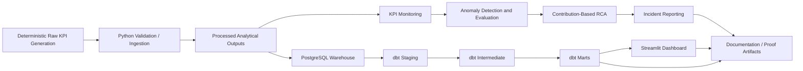

# Architecture Notes

## Notes

- The Python pipeline produces deterministic raw and processed files first.
- PostgreSQL stores raw, analytics, and marts schemas for warehouse proof.
- dbt adds tested staging, intermediate, and mart layers in separate schemas.
- Streamlit reads the local CSV and JSON artifacts by default for easy demos.
- Documentation and outputs are part of the proof, not an afterthought.
