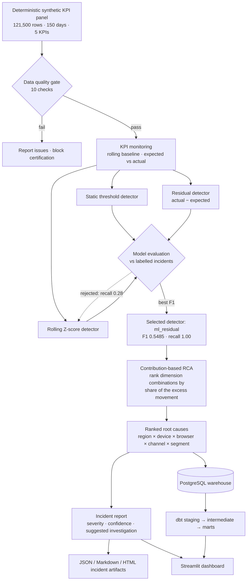

# Decisions & Tradeoffs

Why this system is built the way it is. Each entry gives the context, the options, what was
chosen, and what the choice cost.

All figures come from `data/reports/model_evaluation.csv` and
`data/reports/data_quality_report.json`, both regenerated and verified on 2026-07-25.

---

## 1. Residual detection replaced static thresholds

**Context.** The first monitoring layer compared each KPI against a rolling baseline with a
static tolerance band. It caught everything — and flagged constantly.

**The measurement**, over 121,500 observations with 342 labelled incident rows:

| Detector | Precision | Recall | F1 | TP | FP | FN |
| :--- | ---: | ---: | ---: | ---: | ---: | ---: |
| `monitoring_threshold` | 0.1036 | 1.0000 | 0.1878 | 342 | 2,958 | 0 |
| `rolling_zscore` | 0.1033 | 0.2778 | 0.1506 | 95 | 825 | 247 |
| **`ml_residual`** | **0.3779** | **1.0000** | **0.5485** | 342 | **563** | 0 |
| `combined` | 0.2015 | 1.0000 | 0.3355 | 342 | 1,355 | 0 |

**Chosen.** `ml_residual` — model the expected value from date, categorical dimensions, and
the prior moving baseline, then flag on the residual (actual − expected).

**Why it wins.** A static band cannot tell "unusual for a Tuesday morning on mobile Safari
in APAC" from "unusual overall". Most of its 2,958 false positives are normal variation in
segments whose normal is simply different from the global normal. Modelling the expectation
per segment removes that class of alert entirely.

**Tradeoff.** The residual detector is not interpretable the way a threshold is. "Latency
exceeded 800ms" explains itself; "latency exceeded its expected value by 3.2 residual
standard deviations" needs the contribution-based RCA layer to become actionable. That is
precisely why RCA is part of this system rather than an optional extra.

## 2. Rolling Z-score was rejected despite cutting alert volume

The Z-score detector produced 920 alerts against the threshold baseline's 3,300 — a 72%
reduction, and a tempting headline.

It is rejected because it **missed 247 of 342 incidents**. Recall fell to 27.78% and F1 to
0.1506, *below* the static-threshold baseline it was meant to improve on.

**The general principle:** alert-volume reduction is only meaningful alongside recall. A
detector that alerts on nothing achieves a 100% reduction in false positives. Any reported
reduction in this project is paired with the recall it was achieved at.

## 3. Recall is held at 100%, and precision is the only thing optimised

**Context.** Precision and recall trade off. Something has to be pinned.

**Chosen.** Recall pinned at 1.0; precision maximised subject to that.

**Why.** The cost of the two errors is asymmetric. A false positive costs an analyst a few
minutes of triage. A false negative means a revenue or latency incident ran undetected —
the failure the entire system exists to prevent. Both selected detectors return
`false_negatives = 0`.

**Tradeoff.** Precision tops out at 37.79%, so roughly three in five alerts are still not
incidents. Pushing precision higher means accepting missed incidents, which is not a trade
this system is willing to make. Stating that plainly is more useful than implying the
detector is near-perfect.

## 4. The data is synthetic, and that is a design choice

**Context.** No public KPI dataset carries reliable incident labels.

**Chosen.** Generate a deterministic synthetic panel — 121,500 rows, 150 days, 5 KPIs, 5
dimensions — with three incidents injected at known coordinates.

**Why this is a strength, not a shortcut.** Precision, recall, and F1 are only meaningful
against ground truth. On real unlabelled data every number in section 1 would be an
estimate. Here the labels are exact by construction, so the 81% false-positive reduction is
a measurement rather than a claim.

**The discipline that keeps it honest.** Incident labels are used **only** for evaluation,
never as a model feature — recorded in `model_comparison.json` under `feature_policy`. A
detector trained on the labels would score perfectly and mean nothing.

**Tradeoff.** Synthetic incidents are cleaner than real ones: sharp onset, single cause,
no confounding deploys. Real-world performance would be worse. The repository states the
data is synthetic prominently rather than burying it.

## 5. NumPy ridge regression instead of XGBoost

**Context.** The residual model needs a learned expectation. XGBoost and scikit-learn could
not be imported in the local environment because of native SciPy dependency failures.

**Chosen.** A deterministic NumPy ridge regression fallback. The code attempts XGBoost and
scikit-learn first and falls back only when the import fails; which path ran is recorded in
`model_comparison.json` (`xgboost_used`, `sklearn_used`, `numpy_fallback_used`).

**Why ship the fallback.** A gradient-boosted result that nobody can reproduce is worth less
than a ridge regression that runs anywhere. Every number here comes from code that actually
executed on this machine.

**Tradeoff.** Ridge regression is linear and will underperform a boosted tree on non-linear
KPI behaviour, so 0.5485 F1 is a floor rather than a ceiling. Re-running with XGBoost
available would likely improve it — and would require re-verifying every published figure.

## 6. Incident windows are offsets from the end date, not absolute dates

**Context.** The generator originally hardcoded incident windows as absolute dates
(2026-06-05..06-14 and others) while the data quality layer checks freshness against
*today*, with a 14-day threshold.

**The failure this caused.** The shipped dataset ends 2026-06-30, so from roughly 2026-07-14
onward the project's own quality gate returned `FAIL` and
`tests/test_data_quality.py::test_valid_generated_dataset_passes_quality_validation`
failed on every clone. The repository was quietly rotting on a clock.

**Chosen.** Express incident windows as day offsets back from the dataset's end date, add
`--end-date` to the pipeline, and anchor the quality test's fixture to today.

**Why offsets.** If the end date moves but the incident windows do not, the injected
incidents fall outside the generated range and the labelled ground truth silently
disappears — the evaluation would still produce numbers, just meaningless ones.

**Verified.** With the default end date the refactor is byte-identical: raw data, validated
data, monitoring table, anomaly results, RCA contributions, and model evaluation all
unchanged. Re-anchored to today it produces 121,500 rows with the same 342 labelled
incident rows, and the quality gate returns `PASS` at 100/100.

**Tradeoff worth knowing.** Re-anchoring shifts the residual model's train/test split, which
moves its numbers slightly — `ml_residual` false positives go 563 → 599 and F1 0.5485 →
0.5331. The static-threshold baseline is unaffected at 2,958. The committed dataset stays
pinned to 2026-06-30 so the published figures remain exactly reproducible; the shipped
extract failing its own freshness check is documented rather than hidden.

---

## 7. Two tracks: labelled synthetic for evaluation, live public data for operations

The project originally ran only on synthetic data. That is enough to prove the detector
*works* but not that it *runs*. The obvious upgrade is to point it at real data — but doing
that as a replacement would have destroyed the headline result, because every accuracy
number in this repository depends on knowing which points are genuinely anomalous.

Real data has no labels. No labels means no precision, no recall, no F1. Swapping to live
data would not have improved the evidence; it would have deleted it.

So the two run side by side, and they answer different questions:

| Track | Data | Question it answers | Metrics |
| :--- | :--- | :--- | :--- |
| Evaluation | synthetic, labelled | Is the detector any good? | precision, recall, F1 |
| Operations | Wikimedia pageviews, live | Does it run unattended on data nobody controls? | coverage, anomaly counts, incidents |

This mirrors the standard industry pattern: tune a detector offline against known outcomes,
then run the tuned detector against production traffic where outcomes are unknown. The
detector's F1 is carried into live incident confidence scoring as a *property of the
detector*, tagged with `"f1_source": "synthetic_evaluation_track"` so it can never be
misread as a measurement taken on live data.

**Tradeoff:** two tracks is more surface area to maintain, and the live track can never
produce an accuracy claim. Accepted, because the alternative is either an untested detector
or a dishonest one.

## 8. Dimensions became configurable rather than hardcoded

Adding the live track exposed that `kpi_name/region/device_type/browser/channel/business_segment`
was hardcoded across three core modules. Wikipedia traffic has no regions or browsers — it
has projects, access methods, and agent types.

Two options: map the new dimensions onto the old column names, or make the dimension set a
parameter. The first is faster and dishonest — a column called `region` holding
`"en.wikipedia"` is a lie that survives into every downstream report.

The dimension set is now injected into `KPIMonitor`, `AnomalyDetector` and
`RootCauseAnalyzer`, defaulting to exactly the previous constants. The regression bar was
strict: the synthetic pipeline had to reproduce **byte-identically** afterwards, and it did
— F1 stayed `0.548516` and the processed outputs showed a zero-line diff.

**Tradeoff:** the detector is now schema-agnostic, which is a stronger claim, but the
constants remain as defaults, so nothing enforces that a new track picks sensible dimensions.

## 9. One residual model per series, not per KPI

The first live run flagged **56.6%** of the reporting window as anomalous — obviously
broken. The cause was structural rather than a threshold being too tight.

The residual detector fits one regression per `kpi_name`. The synthetic track has five KPIs,
each with a homogeneous scale, so that works. The live track has a single KPI, `pageviews`,
spanning series that differ by orders of magnitude — English Wikipedia mobile-web user
traffic runs to hundreds of millions of views, while small-wiki mobile-app spider traffic is
in the thousands. One regression across all of them produces enormous *relative* residuals
on every small series, so they sit permanently in breach.

The fix was to make the model fitting group configurable (`model_group_columns`) and fit per
series on the live track. Residual firing dropped from 56.6% to **22.9%**.

Two bugs surfaced underneath it, both now fixed:
- Fitting per series makes the one-hot dimension columns constant, and a series whose data
  starts after the global train/test split date has **zero** training rows. That left the
  Gram matrix singular with an unpenalised intercept, raising `LinAlgError`. Groups below a
  minimum training size now fall back to the rolling baseline instead of inventing a fit.
- The solver gained a least-squares fallback so a degenerate group degrades instead of
  killing the run.

**Still open:** 22.9% is better but still high for a monitoring system, against 2.5% for the
Z-score detector on the same data. The live residual thresholds are inherited from the
synthetic track and have not been calibrated for real traffic volatility. Calibrating them
against the empirical residual distribution is the obvious next step — but it is deliberately
*not* done here, because with no ground truth there is nothing to calibrate against except
a target alert volume, and picking thresholds to hit a nice-looking number is exactly the
kind of reverse-engineering this project exists to argue against.

## Detection to RCA flow

**The step that makes this diagnostic rather than reactive** is G. Detection says a KPI
moved; contribution-based RCA decomposes the movement across dimension combinations and
ranks them by how much of the excess each accounts for. That turns "conversion rate dropped"
into "Mobile + APAC + Safari accounts for 100% of the excess" — which names the thing to go
look at.
